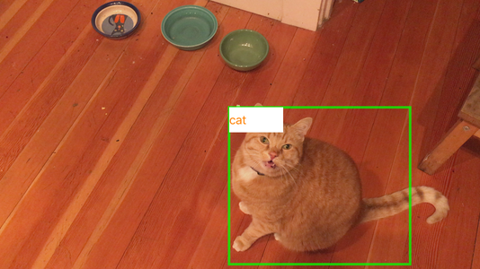

# Tensorflow iOS Object Detection

An Object Detection application on iOS using Tensorflow and pre-trained COCO dataset models.  Video frames are captured and inference is done locally using one of the 3 provided models: ssd_mobilenet_v1_coco, ssd_modelnet_v2_coco, or ssd_inception_v2_coco.  Both Swift and Objective-C projects.

## Building

* Make sure you have automake and libtool.  Using homebrew:

`brew install automake libtool`

* Clone the tensorflow source repo on GitHub

`git clone https://github.com/tensorflow/tensorflow`

* `cd` into the tensorflow repo and at a minimum checkout the `v1.5.0` tag.  The v1.5.0 release has the Makefile support for the following `ANDROID_TYPES` environment variable.  I have tested up to `v1.12.0`

`git checkout origin/r1.11`

if you run into this issue: [thread-local storage is not supported for the current target](https://github.com/tensorflow/tensorflow/issues/18356), you may need to edit the two files affected.  The following one-liners worked for me:

`gsed '/ifeq[^,]*,I386)/!b;n;n;n;n;n;s/thread_local//' < ./tensorflow/contrib/makefile/Makefile > foo; mv foo ./tensorflow/contrib/makefile/Makefile`

`gsed 's/thread_local int per_thread_max_parallism/__thread int per_thread_max_parallism/' < tensorflow/core/util/work_sharder.cc > foo; mv foo ./tensorflow/core/util/work_sharder.cc`

  You can get `gsed` using homebrew: `brew install gnu-sed`

* We need to build the tensorflow components with ANDROID_TYPES_FULL.  In the terminal type:

`export ANDROID_TYPES="-D__ANDROID_TYPES_FULL__"`

* Build the tensorflow libraries for iOS.  Go to the root of your newly downloaded tensorflow repo and run:

`tensorflow/contrib/makefile/build_all_ios.sh`

Go get a coffee. This can take a while.  On my macBook it took almost 2 hours.

* Open either the Swift or Objective-C project in this repo and edit the **tensorflow.xconfig** file to point to the folder where you cloned the tensorflow repo

`TENSORFLOW_ROOT=/Users/username/Development/tensorflow`

* Compile the xcode project and run. Since we need a camera this will only run on a device.
